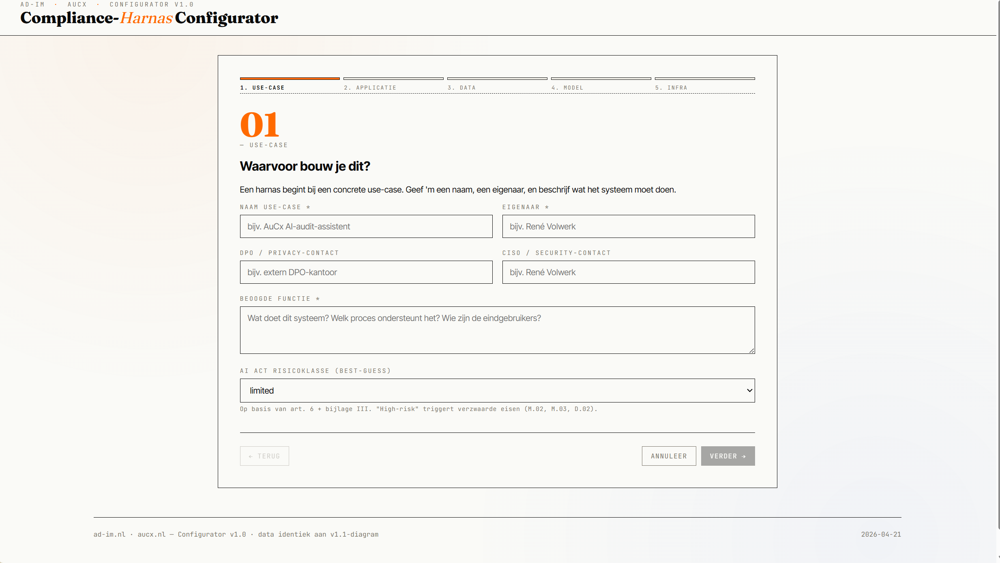

# Compliance-Harnas Configurator

> **A single-file HTML tool that maps one AI use-case to its required compliance controls** — covering EU AVG (GDPR), DORA, NL CBW/NIS2, the EU AI Act, and the STRIDE threat model — and translates the result into runtime artefacts for Claude Code (CLAUDE.md fragment, settings.json hooks, skill pre-flight check).

Two audiences, same data, opposite directions:

- **AI builders** — engineers, product managers, DPOs, CISOs choosing an AI setup. Use the forward-pass: *given these design choices, what must we implement?* Generates `CLAUDE.md` rules and `settings.json` hooks that go straight into the codebase.
- **Auditors** — internal, external, compliance officers reviewing an existing system. Use the reverse-pass: *given this system was deployed, what should it demonstrate?* Same 38 controls become an evidence-linked checklist; exports a NOREA-style markdown dossier.

Both audiences produce and consume the same JSON schema, so a builder's configuration becomes auditable in place, and audit findings can be handed back as annotations on the same object.

No backend. No dependencies. Works offline.



*Wizard step 1 — the configurator walks you through 5 questions (use-case · application · data · model · infra) and activates the relevant subset of 38 harnas-controls.*

---

## What it does

1. **Wizard** — walk through 5 questions about your AI use-case (application · data · model · infra).
2. **Engine** — activates the relevant subset of 38 "harnas" controls across 7 compliance layers (H1 Governance → H7 Assurance).
3. **Cross-references** — each control links to:
   - **EU AVG/GDPR** articles
   - **EU DORA** clauses
   - **NL CBW/NIS2 Control Framework** (26 beheersmaatregelen, ADR & NOREA)
   - **NL DigiD NOREA 3.0** normenkader
   - **EU AI Act** (art. 5, 14, 25, 27, 50)
   - **STRIDE** threat categories (S/T/R/I/D/E)
4. **AI Act triggers** — rule-based detection of obligations that follow from choice-combinations (e.g. *bijzondere PG + public-API → DPIA mandatory; finetuning → possible provider-status art. 25*).
5. **Status tracking** — per control: Open · In progress · Implemented · N/A · Accepted risk — with owner, date, evidence URL, notes.
6. **Export** — JSON (with SHA-256 integrity hash), Markdown (NOREA-style dossier), dedicated STRIDE report, A4 print view.
7. **Steer AI** — generate a `CLAUDE.md` fragment (soft controls) and a `settings.json` hook block (medium controls), so Claude Code actually operates under the harnas.
8. **Pre-flight skill** — `/harnas-check` reads `ACTIVE.json` and returns a GO / WAIT / STOP verdict before you run impactful work.

## Why

Compliance frameworks overlap and compete. Teams drown in checklists that don't map to what their AI system actually does. This tool inverts the flow: configure your system → receive only the obligations that actually apply → track them to closure → generate runtime artefacts that enforce them.

## Quick start

1. Open `src/Compliance-Harnas-Configurator.html` in a modern browser (Chrome/Edge recommended for File System Access API).
2. Click **+ Nieuwe** to start the wizard, or **Import** to load one of the files in `examples/`.
3. After the wizard, explore the tabs: *Overzicht · Controls · Risico's · STRIDE · Toon Harnas · Historie · Export*.
4. When ready, use **Toon Harnas → Save as ACTIVE.json** to make the config available to the `/harnas-check` skill.

## Fits SAAF's four building blocks

This tool is a drop-in contribution to the [SAAF Project](https://saafproject.com/) (Shared Audit Agents Framework):

| SAAF building block | What this configurator provides |
|---|---|
| 🔵 **Prompts / System Instructions** | `Toon Harnas` tab generates a `CLAUDE.md` fragment from 9 soft-tier controls, with your use-case details substituted in. |
| 🟠 **Automation / Integrations** | `Toon Harnas` tab generates a `settings.json` hook block with template commands for 9 medium-tier controls (HITL, DLP, audit-log, prompt-injection scan, retention). |
| 🟢 **Control mappings / Frameworks** | The core: 38 controls × 4+ frameworks × CBW/NIS2 26 BMs × DigiD (partial mapping — 8 AI-relevant norms from NOREA 3.0's 21-norm kader) × STRIDE × AI Act triggers. |
| 🟣 **Report formats / Outputs** | Export as canonical JSON (SHA-256 signed), GitHub-flavored Markdown checklist, dedicated STRIDE threat report, A4 print view. |

Positioned as **infrastructure** for SAAF agents, not one agent among many. Any SAAF agent can ship a harnas-config alongside its code.

## Project layout

```
.
├── src/                        Configurator (single HTML file)
├── schemas/                    JSON Schema for config files
├── examples/                   Demo configurations
├── skills/harnas-check/        Claude Code skill for pre-flight check
├── docs/                       Documentation (NL + EN)
├── .github/                    Issue templates, CI
├── README.md
├── LICENSE                     MIT
├── NOTICE.md                   Attributions (CBW framework, fonts)
├── CONTRIBUTING.md
├── CODE_OF_CONDUCT.md
├── SECURITY.md
└── CITATION.cff
```

## Threat model — dogfooded

The configurator applies STRIDE to itself:

- **S/T** — JSON imports are schema-validated and SHA-256-integrity-checked before they enter your state.
- **I** — Privacy-mode toggle drops all Google Fonts CDN calls (system-font fallback); PII-detection modal warns before any copy/export if BSN/email/phone/IBAN/VAT patterns are detected.
- **R** — Every status change is logged append-only with timestamp; full history travels with JSON exports.
- **E** — `evidence` URLs are whitelisted (`http(s):`, `file:`, `mailto:` only — no `javascript:`).

See [`docs/en/stride-self.md`](docs/en/stride-self.md) for the full analysis.

## License

MIT — see [`LICENSE`](LICENSE).

Third-party data and fonts have their own licenses — see [`NOTICE.md`](NOTICE.md).

## Status

**v0.1.0 — initial public release.** API and mappings may change based on SAAF community feedback. Pin a tag in production.

## Contact & contributions

- Issues: use the templates in `.github/ISSUE_TEMPLATE/`
- Security: see [`SECURITY.md`](SECURITY.md) — disclose privately first
- Contributions: see [`CONTRIBUTING.md`](CONTRIBUTING.md)
